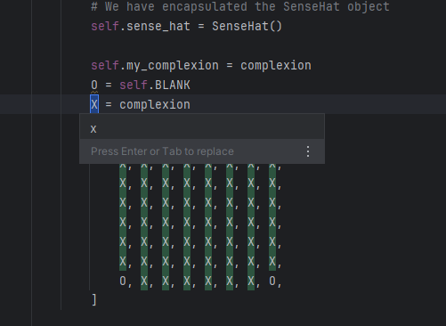

<style>

body {
    counter-reset: h2counter;
}

/* H1 - No numbering */
h1 {
    /* No counter reset or increment */
}

/* H2 - Level 1 numbering */
h2 {
    counter-reset: h3counter;
}

h2::before {
    counter-increment: h2counter;
    content: counter(h2counter) ". ";
}

/* H3 - Level 2 numbering */
h3 {
    counter-reset: h4counter;
}

h3::before {
    counter-increment: h3counter;
    content: counter(h2counter) "." counter(h3counter) " ";
}

/* H4 - Level 3 numbering (optional) */
h4 {
    counter-reset: h5counter;
}

h4::before {
    counter-increment: h4counter;
    content: counter(h2counter) "." counter(h3counter) "." counter(h4counter) " ";
}

</style>

# Evidence and Knowledge

This document includes instructions and knowledge questions that must be completed to receive a *Competent* grade on this portfolio task.

## Required evidence

### Answer all questions in this document

- Each answer should be complete, well-articulated, and within the specified word count limits (if added) for each question.
- Please make sure **all** external sources are properly cited.
- You must **use your own words**. Please include your full chat transcripts if you use generative AI in any way.
- Generative AI hallucinates, is not an authoritative source

### Make all the required modifications to the code

- Please follow the instructions in this document to make the changes needed to the code.

- When requested to upload evidence, upload all screenshots to `screenshots/` and embed them in this document. For example:

```markdown

```

- You must upload the code into your GitHub repository.
- While you can use a branch, your code should be in main when you submit.
- Upload a zip of this repository to Blackboard when you are ready to submit.
- You will be notified of your result via Blackboard
- However, if using GitHub classrooms, you may also receive additional feedback on GitHub directly

### Optional: Use of Raspberry Pi and SenseHat

Raspberry Pi or SenseHat is **optional** for this activity. You can use the included `sense_hat.py` file to simulate the SenseHat on your computer.

If you use a Pi, please **delete** the `sense_hat.py` file.

### Accessible version of the code

This project relies on visual patterns that appear on an LED matrix. If you have any accessibility requirements, you can use the `udl/accessible` branch to complete the project. This branch provides an accessible code version that uses text-based patterns instead of visual ones.

Please discuss this with your lecturer before using that branch.

## Specific Tasks & Questions

Address the following tasks and questions based on the code provided in this repository.

### Set up the project locally

1. Fork this repository (if not using GitHub Classrooms)
2. Clone your repository locally
3. Run the project locally by executing the `main.py` file
4. Evidence this by providing screenshots of the project directory structure and the output of the `main.py` file


If you are running on a Raspberry Pi, you can use the following command to run the project and then screenshot the result:

```bash
ls
python3 main.py
```

### Fundamental code comprehension

 Answer each of the following questions **as they relate to that code** supplied by in this repository (ignore `sense_hat.py`):

1. Examine the code for the `smiley.py` file and provide  an example of a variable of each of the following types and their corresponding values (`_` should be replaced with the appropriate values):

   | Type                    | name   | value           |
   | ----------              |--------|-----------------|
   | built-in primitive type | dimmed | True            |
   | built-in composite type | WHITE  | (255, 255, 255) |
   | user-defined type       | Smiley | Smiley()        |

2. Fill in (`_`) the following table based on the code in `smiley.py`:

   | Object                   | Type           |
   | ------------             |----------------|
   | self.pixels              | List           |
   | A member of self.pixels  | Tuple of Int   |
   | self                     | Class instance |

3. Examine the code for `smiley.py`, `sad.py`, and `happy.py`. Give an example of each of the following control structures using an example from **each** of these files. Include the first line and the line range:

   | Control Flow | File      | First line                 | Line range |
   | ------------ |-----------|----------------------------|------------|
   |  sequence    | smiley.py | self.sense_hat = SenseHat()| 13 - 26    |
   |  selection   | sad.py    | eyes = [10, 13, 18, 21]    | 24 - 30    |
   |  iteration   | happy.py  | mouth = [41, 46, 50, 51, 52, 53] | 20 - 22    |

4. Though everything in Python is an object, it is sometimes said to have four "primitive" types. Examining the three files `smiley.py`, `sad.py`, and `happy.py`, identify which of the following types are used in any of these files, and give an example of each (use an example from the code, if applicable, otherwise provide an example of your own):

   | Type                    | Used? | Example                               |
   | ----------------------- |-------|---------------------------------------|
   | int                     | Yes   | eyes = [10, 13, 18, 21]               |
   | float                   | Yes   | delay = 0.25                          |
   | str                     | No    | smiley_face = "This is a smiley face" |
   | bool                    | Yes   | dimmed = True                         |

5. Examining `smiley.py`, provide an example of a class variable and an instance variable (attribute). Explain **why** one is defined as a class variable and the other as an instance variable.

> The colours defined as constants (WHITE, GREEN etc) are examples of a class variable.The colours are defined as a class variable and can be accessed from the class as well as an instance of that class. Using the example of WHITE, the insinuation is that all Smiley's that have white in them, have this specific white.  
>
> An example of an instance variable is self.pixels = [etc]. It is defined in a class but is unable to be referenced from the class. It is referenced from an instance of that class. Every object created through initialisation it has their own copy of that instance variable. If changes were to be made, it only affects that specific instance and not others.     
>

6. Examine `happy.py`, and identify the constructor (initializer) for the `Happy` class:
   1. What is the purpose of a constructor (in general) and this one (in particular)?

   > The constructor is the __init__ method. The purpose of a constructor in general is to be called when an object is created from the blueprint. When the object is initialised the constructor assigns values to variables within the class in order to be created. 
   > 
   In this particular example the constructor is utilised to initialise and construct the basis of a smiley face. It does this through inheritance from the Smiley class and is initialised through the super call.   
   >

   2. What statement(s) does it execute (consider the `super` call), and what is the result?

   >  When the super call is executed, the init method seeks to initilise from Happy's parents, which is the Smiley class. In the smiley class, a SenseHat is created, and the variables yellow and blank are defined. The self.pixels list is defined, before returning back to the happy class. In order to create this instance of smiley, the foundation is built, before the methods and attributes are called to make this smiley a 'happy' one. A mouth and eyes are drawn through two methods, draw_mouth() and draw_eyes(). Both these methods reference the instance variables (YELLOW, BLANK) that were initialised previously in order to change the values in the self.pixels list when super was called. This changes the pixels for this specific smiley and is what creates the 'happy' smiley.  
   >

### Code style

1. What code style is used in the code? Is it likely to be the same as the code style used in the SenseHat? Give to reasons as to why/why not:
   
> The code style used in this code is PEP8. It is likely to be the same code style used in the SenseHat. 
> The first reason is the usage of PascalCase. This convention is the PEP8 style used to define classes. Which both SenseHat and other classes defined in this code hade in common. 
> The second reason is the usage of snake_case. When an instance of SenseHat was created, it was defined with the name sense_hat, which is naming convention for variables which consist of lowercase, seperated by underscores to differentiate types. 
> When SenseHat was imported in from sense_hat, this convention was also followed. 
>

2. List three aspects of this convention you see applied in the code.

> An example of this naming convention found in the code is in the function dim_display. When it references the snese_hat instance that was created, low_light follows lowercase/underscore naming rules. 
> In the next function show, set_pixels follows same convention. 
> The third as mentioned previously is evidenced in the import of SenseHat(). 
> 

3. Give two examples of organizational documentation in the code.

> One example or organisational documentation is in smiley.py where a comment was used to explain that the SenseHat object was encapsulated. 
> Another example of organisational documentation is the usage of docstrings to explain what a function does. The show function explains the function shows the smiley on the screen. 
>

### Identifying and understanding classes

> Note: Ignore the `sense_hat.py` file when answering the questions below

1. List all the classes you identified in the project. Indicate which classes are base classes and which are subclasses. For subclasses, identify all direct base classes.
  
  Use the following table for your answers:

| Class Name                                     | Super or Sub?                           | Direct parent(s)                            |
|------------------------------------------------|-----------------------------------------|---------------------------------------------|
| NotReal                                        | Sub                                     | NotRealParent                               |
| Smiley<br/>Happy<br/>Sad<br/>Blinkable<br/>SenseHat | Super<br/>Sub<br/>Sub<br/>Sub<br/>Super | None<br/>Smiley<br/>Smiley<br/>ABC<br/>None |


2. Explain the concept of abstraction, giving an example from the project (note "implementing an ABC" is **not** in itself an example of abstraction). (Max 150 words)

> Abstraction is a method used wherein we identify a characteristic that is required which we want to create an object out of. How this characteristic gets implemented though is not important. When an abstract class is created, the class is not instantiated. It is merely a blueprint for production of said object. An example of this is the blinkable class. It inherits from ABC (which gives it the abstract base case label, so we identify it as such), but what makes it abstract is the blink method and its lack of definition. It uses the decorator abstract method, which means any class that inherits from blinkable blinks and needs to be defined when initilised. How it actually blinks is not defined. 
>

3. What is the name of the process of deriving from base classes? What is its purpose in this project? (Max 150 words)

> The name of the process of deriving from base classes is called inheritance. It can be generalised classes, as in the case of Smiley which the more specialised subclasses of both Sad and Happy inherit from. The reason inheritance is used is mostly for code reuse. If there is a Super class, subclasses can use this blueprint to derive variations of other types of smileys. This is easier than repetitive code where a sad or happy smiley needs to be made form scratch. There are common traits which makes reusability more efficient. In this code you'll see that all smileys have the same base layout and colours. They all share traits such as dimmed display and being able to see the smiley on the screen. They may differ in pixels depending on expression but their base is the same.    
>

### Compare and contrast classes

Compare and contrast the classes Happy and Sad.

1. What is the key difference between the two classes?
   > The key difference between the two classes is that Happy inherits from the Blinkable class and is able to blink while Sad doesn't inherit this and also has no blink method.  
   >
2. What are the key similarities?
   > The key similarities is that both Happy and Sad have draw_mouth and draw_eyes methods. Despite both having these methods, the pixels have some slight variation in allocation of colour in order to make the image required.  
   >
3. What difference stands out the most to you and why?
   > The Blinkable class that Happy inherits from stands out to me the most. Inheriting from Blinkable means that for a Smiley to be Happy it must be able to blink, whereas without inheriting from Blinkable, the Happy Smiley can still have a blink method, meaning it can blink, but doesn't require it to be defined as happy. 
   >
4. How does this difference affect the functionality of these classes
   > The difference ensures that all Happy smileys must be able to blink, although the way it does may vary. Without blinking it is not a Happy smiley. Whereas, for the Sad smiley, it can blink if we want it to, but can still exist as a Sad Smiley without needing to blink either. 
   >

### Where is the Sense(Hat) in the code?

1. Which class(es) utilize the functionality of the SenseHat?
   > All classes that inherit from Smiley as well as Smiley itself can utilise the functionality of the SenseHat. It is created as an object when Smiley is initiailised and encapsulated. It is referenced in the two methods of dim_display and show, which will utilise the SenseHat object when either is called. 
   >
2. Which of the SenseHat's functionalities do(es) it /them utilize? 
   > It utilises the show and dim display function of SenseHat. 
   >
3. Discuss the hiding of the SenseHAT in terms of encapsulation (100-200 Words)
   > Encapsulation is about differentiating between what should and shouldn't be accessed so freely, thereby creating a boundary of sorts. Things that shouldn't be accessed outside the class and seen in a public interface is encapsulated. This could be for a variety of reasons. SenseHat is encapsulated, as code that exists there for functionality but need not be accessed by everyday users to maintain consistency. This reduces potential for error and bugs when there is too much access to something that can run smoothly in the background.
   >

### Sad Smileys Can’t Blink (Or Can They?)

Unlike the `Happy` smiley, the current implementation of the `Sad` smiley does not possess the ability to blink. Let's first explore how blinking has been implemented in the Happy Smiley by examining the blink() method, which takes one argument that determines the duration of the blink.

**Understanding Blink Mechanism:**

1. Does the code's author believe that every `Smiley` should be able to blink? Explain.

> No, the code's author doesn't believe every Smiley should be able to blink. This is evident in the way the code was written. If they believed all Smileys should blink, Smiley would inherit from the Blinkable class to ensure that every subclass or smiley derived from it blinked and how it did this would have to be defined at initialisation. 
>

2. For those smileys that blink, does the author expect them to blink in the same way? Explain.

> No, for the Smileys that blink, the author doesn't expect them to blink in the same way. This is because the Blinkable class has an abstract method, which acts as blueprint for being able to blink, but it doesn't define how it should blink. When it is initialised, how the author thinks an instance of smiley should blink will then be defined. 
>

3. Referring to the implementation of blink in the Happy and Sad Smiley classes, give a brief explanation of what polymorphism is.

> Polymorphism can be referred to as 'many forms'. It is the ability of different classes to use the same method, executed differently. In the case of Happy and Sad Smiley classes, if they were both to inherit from the Blinkable class, the way they blink doesn't necessarily have to be the same, even though it's the same method, the way it's executed can differ. One may blink for a second longer for example or blink with different colours, but they would both be able to, hence many forms. 
>

4. How is inheritance used in the blink method, and why is it important for polymorphism?

> Blinkable inherits from ABC, and the abstract method decorater is used. This means anythign that inherits from Blinkable must define how to blink at initialisation. When a class inherits from Blinkable, it inherits the blink method. This is important for polymorphism, as it allows for the many forms behaviour discussed earlier. Having a blinkable class that has a blink method used in this way, gives a generic canvas to express the many ways different objects can perform the same method, which is the essence of polymorphism.  
>
1. **Implement Blink in Sad Class:**

   - Create a new method called `blink` within the Sad class. Ensure you use the same method signature as in the Happy class:

   ```python
   def blink(self, delay=0.25):
       pass  # Replace 'pass' with your implementation
   ```

2. **Code Implementation:** Implement the code that allows the Sad smiley to blink. Use the implementation from the Happy Smiley as a reference. Ensure your new method functions similarly by controlling the blink duration through the `delay` argument.

3. **Testing the Implementation:**

- Test the new blink functionality on your Raspberry Pi or within the Python classes provided. You might need to adjust the `main.py` script to incorporate Sad Smiley's new blinking capability.

Include a screenshot of the sad smiley or the modified `main.py`:


- Observe and document the Sad smiley as it blinks its eyes. Describe any adjustments or issues encountered during implementation.

  > There was an issue running the code, as when I ran it in the main, I hadn't imported time in the sad.py file, so the blink method did not work. After adjusting this, and running it in main, I encountered one more area, where the import of Sad from sad.py wasn't written correctly. After this last adjustment, the code worked. 

  ### If It Walks Like a Duck…

  Previously, you implemented the blink functionality for the Sad smiley without utilizing the class `Blinkable`. Assuming you did not use `Blinkable` (even if you actually did), consider how the Sad smiley could blink similarly to the Happy smiley without this specific class.

  1. **Class Type Analysis:** What kind of class is `Blinkable`? Inspect its superclass for clues about its classification.

     > Blinkable is an Abstract Class. It inherits from the superclass ABC, and is therefore considered to be a type of Abstract Base Class as well.   

  2. **Class Implementation:** `Blinkable` is a class intended to be implemented by other classes. What generic term describes this kind of class, which is designed for implementation by others? **Clue**: Notice the lack of any concrete implementation and the naming convention.

  > Realisation is the generic term which describes this kind of class. Realisation is the relationship between one class that acts as a contract and the other class which makes an agreement to carry out the contract. Blinkable is the interface and the other class that carries out and implements the interface.
  > 
  3. **OO Principle Identification:** Regarding your answer to question (2), which Object-Oriented (OO) principle does this represent? Choose from the following and justify your answer in 1-2 sentences: Abstraction, Polymorphism, Inheritance, Encapsulation.

  > It represents Inheritance. Subclasses inherit from the interface that isn't implemented and then carries out the implementation as part of a 'contract' when it inherits from them. 

  4. **Implementation Flexibility:** Explain why you could grant the Sad Smiley a blinking feature similar to the Happy Smiley's implementation, even without directly using `Blinkable`.

  > The Sad Smiley can blink as well, as the method was given to it. It doesn't need to be blinkable to blink. The only thing blinkable does, is ensuring that the class that inherits from it, must have a blink method. 

  5. **Concept and Language Specificity:** In relation to your response to question (4), what is this capability known as, and why is it feasible in Python and many other dynamically typed languages but not in most statically typed programming languages like C#? **Clue** This concept is hinted at in the title of this section.

  > This concept is known as duck typing. It is feasible in Python and other dynamically typed languages as it relies on compatibility at runtime with the part that is accessed when the code runs. Python doesn't require any specifications to run a method, it tries it and sees if it works. It cares what something does, as opposed to what something is. In statically typed languages, the reliance on compatibility is with the structure as a whole. If part of the structure is compatible but the whole isn't, it won't run. These languages care what something is and the emphasis is put on types.  

  ***

  ## Refactoring

  ### Does a Smiley Have to Be Yellow?

  While our current implementation predominantly features yellow smileys, emotional expressions like sickness or anger typically utilize colors like green, red, or orange. We'll explore the feasibility of integrating these colors into our smileys.

  1. **Defined Colors and Their Location:**

     1. Which colors are defined and in which class(s)?
        > The colours white, green, red, yellow and blank are defined in the Smiley Class. 
     2. What type of variables hold these colors? Are the values expected to change during the program's execution? Explain your answer.
        > The variable Y holds the colour yellow and the variable O holds the blank value. The values are not expected to change during the program's execution. As it is defined in the Smiley, which is the superclass, all the subclasses derived from it are expected to have these specific colours. If there is a white in a smiley, it would be this specific white.   
        3. Add the color blue to the appropriate class using the appropriate format and values.
    

  2. **Usage of Color Variables:**

     1. In which classes are the color variables used?
        > In both the Sad class and the Happy class. 

  3. **Simple Method to Change Colors:**
  4. What is the easiest way you can think to change the smileys to green? Easiest, not necessarily the best!
     > Change the value of the Y = self.YELLOW to Y = self.GREEN

  Here's a revised version of the "Flexible Colors – Step 1" section for the smiley project, incorporating your specifications for formatting and content updates:

  ### Flexible Colors – Step 1

  Changing the color of the smileys once is straightforward, but it isn't very flexible. To facilitate various colors for smileys, it is advisable not to hardcode values in any class. This approach was identified earlier as a necessary change. Let's start by removing the built-in assumptions about color in our classes.

  1. **Add a method called `complexion` to the `Smiley` class:** Implement this instance method to return `self.YELLOW`. Using the term "complexion" instead of "color" provides a more abstract terminology that focuses on the meaning rather than implementation.

  2. **Refactor subclasses to use the `complexion` method:** Modify any subclass that directly accesses the color variable to instead utilize the new `complexion` method. This ensures that color handling is centralized and can be easily modified in the future.

  3. **Determine the applicable Object-Oriented principle:** Consider whether Abstraction, Polymorphism, Inheritance, or Encapsulation best applies to the modifications made in this step.

  4. **Verify the implementation:** Ensure that the modifications function as expected. The smileys should still display in yellow, confirming that the new method correctly replaces the direct color references.

  This step is crucial for setting up a more flexible system for color management in the smiley display logic, allowing for easy adjustments and extensions in the future.

  ### Flexible Colors – Step 2

  Having removed the hardcoded color values, we now enhance the base class to support dynamic color assignments more effectively.

  1. **Modify the `__init__()` method in the `Smiley` class:** Introduce a default argument named `complexion` and assign `YELLOW` as its default value. This allows the instantiation of smileys with customizable colors.

  2. **Introduce a new instance variable:** Create a variable called `my_complexion` and assign the `complexion` parameter to it. This step ensures that each smiley instance can maintain its own color state.

  3. **Rationale for `my_complexion`:** Using a distinct instance variable like `my_complexion` avoids potential conflicts with the method parameter names and clarifies that it is an attribute specific to the object.

  4. **Bulk rename:** We want to update our grid to use the value of complexion, but we have so many `Y`'s in the grid. Use your IDE's refactoring tool to rename all instances of the **symbol** `Y` to `X`. Where `X` is the value of the `complexion` variable. Include a screenshot evidencing you have found the correct refactor tool and the changes made.

  

  5. **Update the `complexion` method:** Adjust this method to return `self.my_complexion`, ensuring that whatever color is assigned during instantiation is what the smiley displays.

  6. **Verification:** Run the updated code to confirm that Smileys still defaults to yellow unless specified otherwise.

  ### Flexible Colors – Step 3

  With the foundational changes in place, it's now possible to implement varied smiley colors for different emotional expressions.

  1. **Adjust the `Sad` class initialization:** In the `Sad` class's initializer method, change the superclass call to include the `complexion` argument with the value `self.BLUE`, as shown:

     ```python
     super().__init__(complexion=self.BLUE)
     ```

  2. **Test color functionality for the Sad smiley:** Execute the program to verify that the Sad smiley now appears blue.

  3. **Ensure the Happy smiley remains yellow:** Confirm that changes to the Sad smiley do not affect the default color of the Happy smiley, which should still display in yellow.

  4. **Design and Implement An Angry Smiley:** Create an Angry smiley class that inherits from the `Smiley` class. Set the color of the Angry smiley to red by passing `self.RED` as the `complexion` argument in the superclass call.

  ***
